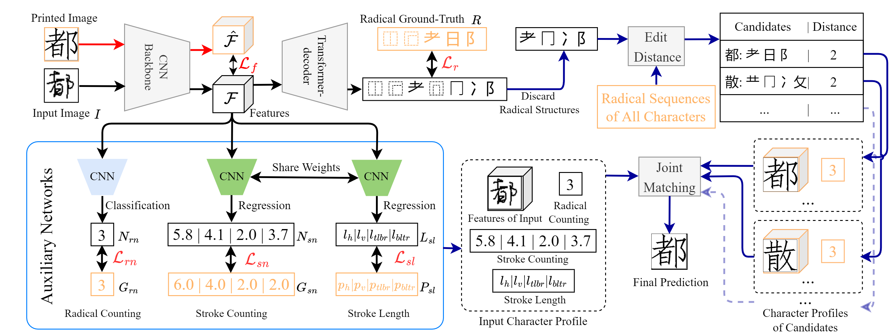

# Chinese Character Recognition with Augmented Character

This is the code of the ACMMM2022 paper "Chinese Character Recognition with Augmented Character
Profile Matching". [[link]](https://github.com/FudanVI/FudanOCR/tree/main/character-profile-matching/paper)




## Dependencies
Build up an environment with python3.7, and install corresponding dependent packages
```python
pip install -r requirement.txt
```

## Dataset
* HWDB dataset can be available in [link](http://www.nlpr.ia.ac.cn/databases/handwriting/Home.html)
* CTW dataset can be available in [link](https://ctwdataset.github.io/)
* The Printed Chinese character datasets in the SIMFANG font are available in ```./printstandard``` and ```./printstandard_ctw```

## Labeling
Four types of labels for Chinese characters can be found in ```./data```
* ```./data/xxx_rad_num.txt``` --- the number of radicals
* ```./data/xxx_stroke_num.txt``` --- the total number of oriented strokes
* ```./data/xxx_stroke_len.txt``` --- the length of oriented strokes
* ```./data/stroke_orientation_num.txt``` --- the number of oriented strokes for radicals

## Experiment
Please remember to modify ```config.py``` and then execute
```python
CUDA_VISIBLE_DEVICES=GPU_NUM python train.py
```

To train the model, set ```test_only = False``` and ```mode = radical``` in ```config.py```.

In the test stage, set ```test_only = True``` and ```resume = 'PATH_TO_PRETRAINED_MODEL'```.

## Acknowledge
We implement our model following the radical-level CCR baseline of [chen et al.](https://github.com/FudanVI/FudanOCR/tree/main/stroke-level-decomposition), [@JingyeChen](https://github.com/JingyeChen) 
Thanks for the contribution!

## Citation
```python
@inproceedings{zu2022chinese,
  title={Chinese Character Recognition with Augmented Character Profile Matching},
  author={Zu, Xinyan and Yu, Haiyang and Li, Bin and Xue, Xiangyang},
  booktitle={Proceedings of the 30th ACM International Conference on Multimedia},
  pages={6094--6102},
  year={2022}
}
```
